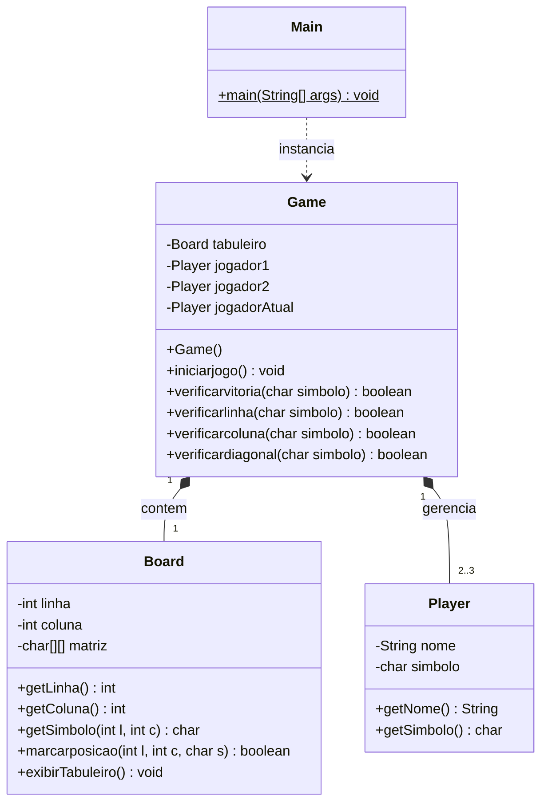

# board-game-engine
Trabalho da disciplina de LPOO onde tem como foco criar em Java, uma Game Engine (motor de jogo) para jogos de tabuleiro com foco em Orientação a Objetos e arquivos de configuração (como JSON)
## Diagrama de Classes

